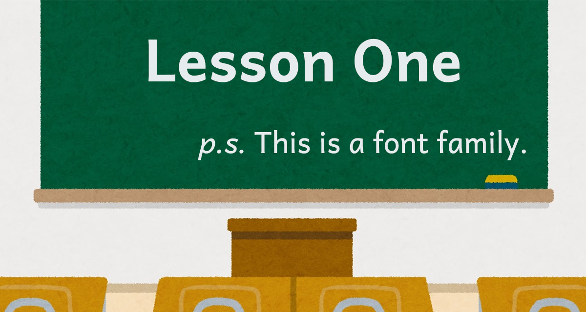

# Lesson One
An open source font derived from Andika. 

Lesson One 是基於 SIL 組織的 Andika 衍生的開源字型。  

[字型展示頁面請點選這裡](https://buttaiwan.github.io/lesson1/)。

## 介紹 Andika 字型

SIL 組織的 [Andika](https://github.com/silnrsi/font-andika) 是為了推展世界掃盲而設計的字體。不只支援 Unicode 裡幾乎所有拉丁文變體，且盡可能貼近手寫字形，又特別考量讀寫障礙族群的需求，非常適合教育使用（詳細說明請參考 [Andika](https://software.sil.org/andika/) 官網）。

然而 Andika 部份字母的預設寫法與台灣學校教育使用的習慣不同，且它雖然涵蓋了全球五大洲各種語言用到的各種拉丁文字符，偏偏就是缺乏一些台羅拼音等台灣在地會用到的字符。而 Lesson One 正式為此所生。

## Lesson One 與 Andika 的不同處

### 支援台灣在地需要的各種字母

Lesson One 支援以下各種拼音會用到的所有字母與聲調組合：

* 漢語拼音，例如：āáǎàēéěèīíǐìōóǒòūúǔùüǖǘǚǜêê̄ếê̌ềm̄ḿm̌m̀n̄ńňǹ
* 教育部台羅拼音，例如：a̍a̋e̍e̋i̍i̋o̍u̍m̀m̂m̌m̄m̍m̋m̆n̂n̄n̍n̋n̆
* 台語白話字，例如：o͘ó͘ò͘ô͘ǒ͘ō͘o̍͘ŏ͘ő͘ⁿ
* 教育部客語拼音，例如：ˊˇˆˋ⁺
* 教育部族語拼音，例如：ʼ⌃ṟéɨʉṞÉƗɄ
* 馬祖福州語拼音，例如：āǎáàâēěéèêīǐíìîōǒóòôūǔúùûȳy̌ýỳŷ
* 客語白話字，例如：ṳṳ̂ṳ̀ṳ́ṳ̍
* KK音標，例如：aæɛəɪɔʌɚɝ aɪau θʃðʒŋḷṃṇ ‵ʹ͵
* DJ音標，例如：ɑæəɜɪɔʊʌː aɪaʊ θʃðʒŋ ˈˌ
	- 注意因 a 預設是單層，而 Unicode 沒有兩層 a 的字碼，故以標準連字方式來實作。當 a 出現在 ɪuʊ 之前時顯示為兩層。
	- 音標不建議使用斜體。

同時移除台灣幾乎不會用到的其他語言字母，大幅精簡字型檔大小。

### 符合課本上的寫法

諸如小寫 a、g、t，大寫 I、J、M、W 等都符合課本寫法。

### 提供多種字重與可變字型

除了原有的 Regular 與 Bold 之外，再提供 Light、Medium、Heavy 三種字重，適合內文到標題等各種需求，製作投影片、講義均相當實用。各字重也都有提供義大利斜體。

並同時發佈 OpenType 1.8 的可變字型版本。

### 增加自動調距資訊

原 Andika 字型並無字偶 kerning 設計，Lesson One 針對常見的字母組合都加以適當調距處理。

## 最新版本與下載方式

目前最新版本為 1.000。

一般電腦安裝版本，請點選本頁面右側「[Releases](https://github.com/ButTaiwan/LessonOne/releases)」處的最新發行版本，下載 LessonOne.zip。解壓縮後安裝裡面的 .ttf 字型檔案即可。

可變字型版本、網頁字型 woff 版本請從原始碼 clone。

## 開源授權規定

* 本字型基於 SIL Open Font License 1.1，改造 SIL 發佈的 [Andika](https://github.com/silnrsi/font-andika) 開源專案。
* Andika 是 SIL 的商標。
* Lesson One 是本專案的保留名稱。
* 任何人可以無償使用此字型，包含商用。無須告知原作者。
* 您可自由傳送、分享此字型，或與其他軟體綑綁發行、銷售。捆包中必須同時包含授權文件檔（OFL.txt）。
* 您可自由改造、衍生此字型並公開。修改後的字型必須同樣以 [SIL OFL](https://scripts.sil.org/OFL) 進行發佈，並請勿使用字型的保留名稱。
* 依照 [SIL OFL](https://scripts.sil.org/OFL) 規定，**禁止單獨出售字型檔(ttf/otf)**。

## 請斗內QQ

個人維護開源字型工程浩大，有足夠的支持，才有持續改版、精進的空間。若您覺得此字型能幫助到您，麻煩贊助一下吧Q_Q

信用卡（含國際信用卡）、超商條碼、超商代收，請 [點這裡](https://p.ecpay.com.tw/930AED7) 。
